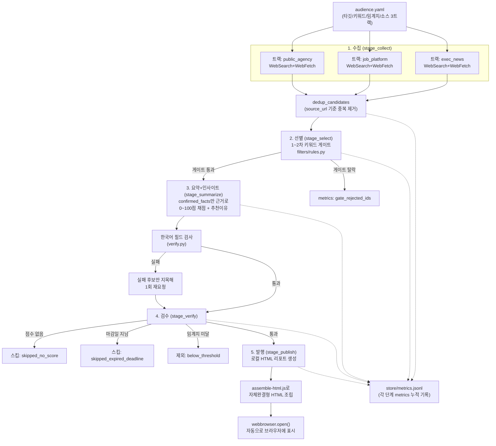
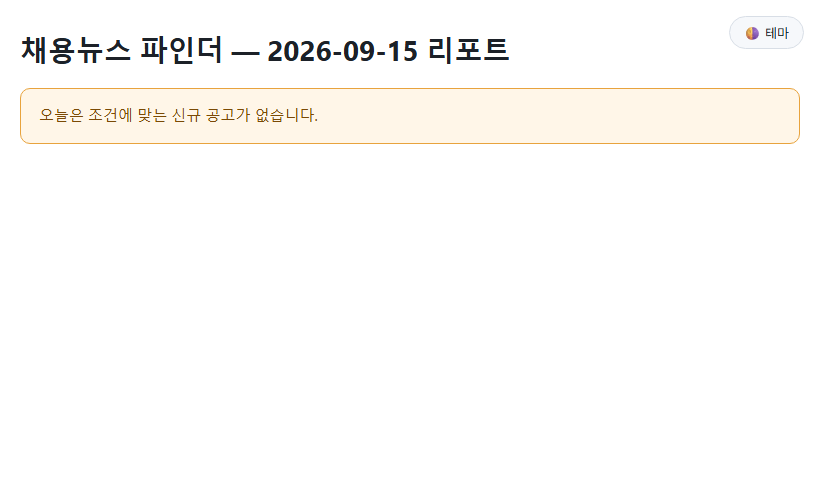
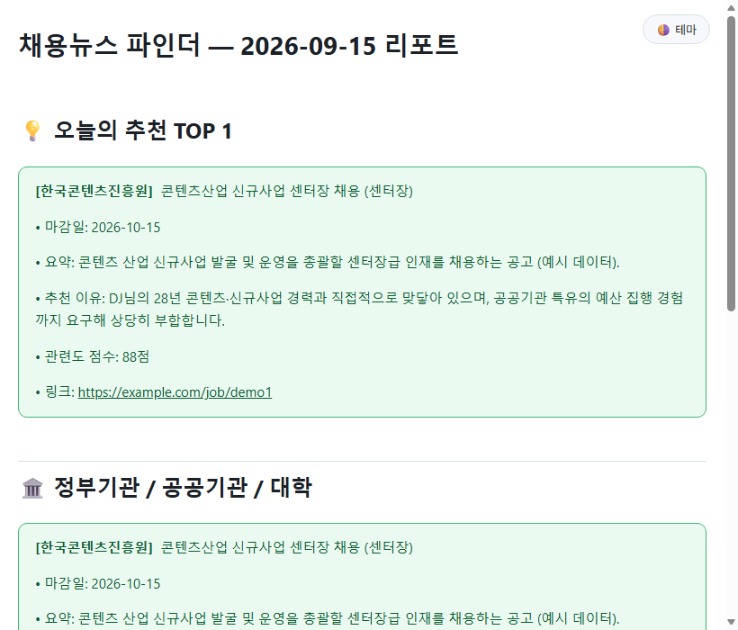

# REPORT — JobNewsLite (채용뉴스 파인더)

> 아이펠 N036 "나만의 뉴스레터 에이전트 구축하기" 실습 과제 제출용 리포트.
> 이 프로젝트는 과제를 위해 새로 만든 것이 아니라, **어제(2026-09-13)부터 이미 진행 중이던
> 개인 프로젝트**를 오늘 과제 기준에 맞춰 정리한 것입니다 — 그 경위를 1장에 밝힙니다.

---

## 1. 분야 및 독자 정의

### 이 프로젝트의 배경 (과제 이전부터의 경위)

1. **2026-09-13**: v1(`PRD_채용정보_자동알림시스템.md`) — 워크넷 스크래핑 + Gmail OAuth2
   자동 발송 + GitHub Actions 매일 스케줄이라는, 채용정보 건수에 비해 과한 구조로 구축.
2. **2026-09-14**: N036 강의(뉴스레터 에이전트) 챕터 8까지 직접 실습하며 5단계 파이프라인
   (수집→선별→요약→검수→발행)과 "필드별 검증" 원칙을 확인. 이걸 계기로 v1이 과하다고
   판단해, v2(`PRD_v2_가벼운버전(JobNewsLite).md`)로 다시 설계 — 스크래핑 대신 WebSearch,
   Gmail 발송 대신 로컬 HTML 리포트로 가볍게 전환.
3. **2026-09-14~15 (이 세션)**: v2 PRD대로 Phase 1을 구현하고 실제 라이브 실행까지 검증하는
   중, N036 실습 자료와 오늘 과제 안내를 받아 **이 진행 중이던 프로젝트를 과제 제출 형식에
   맞춰 정리**하기로 했습니다. 그래서 도메인 선택("왜 채용정보인가")은 과제를 위해 고른 것이
   아니라, 실제로 해결하려던 개인적 필요(DJ 대표님의 이직/영입 정보 모니터링)에서 나왔습니다.

### 분야

**채용 뉴스 — 콘텐츠산업/신규사업 분야 임원급 채용·인사 정보**. AI 뉴스가 아니라 실제 이직/
채용 의사결정에 쓰이는 정보라는 점에서, 과제 안내의 RSS 제외 목록(OpenAI/DeepMind/TechCrunch
등 AI 뉴스 블로그)은 **애초에 해당 사항이 없습니다** — 그 목록은 AI 뉴스 도메인을 고른 팀을
위한 것이고, 이 프로젝트는 처음부터 다른 분야를 다룹니다.

### 타깃 독자 페르소나

| 항목 | 내용 |
|---|---|
| 이름 | DJ 대표 |
| 배경 | 콘텐츠산업(방송·게임·웹툰·K-컬처) 및 신규사업 기획/전략기획 분야 28년 경력 |
| 관심사 | 본인 경력과 맞닿은 임원급 이직/영입 기회를 놓치지 않는 것 |
| 관심 그룹 1 | 정부·공공기관·대학의 콘텐츠/신규사업 관련 조직 — 센터장·본부장·팀장·책임연구원·전문위원급 |
| 관심 그룹 2 | 일반기업 콘텐츠/신사업/전략기획 분야 — C-Level, 임원급(이사/상무/전무), 본부장/총괄 |
| 실행 빈도 | 매일 자동이 아니라 **필요할 때 수동 실행**(바탕화면 아이콘 더블클릭) — 건수가 많지 않은 채용정보 특성상 |

정확한 조건 정의는 [`audience.yaml`](./audience.yaml)에 있으며, 이 파일이 선별 기준의 단일
출처입니다(코드에 하드코딩하지 않음).

---

## 2. 소스 채택표

### 검토한 소스 후보 전체 목록

| 후보 | 검토 결과 | 채택 여부 | 근거 |
|---|---|---|---|
| 워크넷 오픈 API | v1에서 신청서(`워크넷 오픈API 채용정보 서비스 신청서.hwp`)까지 작성했으나 발급·승인 대기 상태 | **탈락(이번 버전)** | 오늘 세션 내 API 키 승인을 받을 수 없어 실제로 쓸 수 없음. 승인되면 소스 트랙으로 추가 가능(6장 개선 아이디어) |
| Google News RSS + `googlenewsdecoder` | N036 실습(`newsletter_agent_full_colab.ipynb`)에서 AI/콘텐츠 뉴스 도메인으로 이미 검증 | **탈락(이번 버전)** | 뉴스 기사 형태 정보에는 강하지만, "공고 원문"(자격요건·마감일 등)에 직접 접근하기 어려움 — 이 프로젝트는 공고 본문 확인(G1 관문)이 중요해서 부적합 |
| 특정 채용 사이트 스크래핑(사람인/잡코리아 등) | v1이 이미 워크넷 스크래핑에서 "사이트 구조가 바뀌면 깨진다"를 겪음 | **탈락** | 유지보수 비용이 이 프로젝트 규모(반나절 구축, 저빈도 수동 실행)에 맞지 않음(PRD v2 2장) |
| Claude Agent SDK `WebSearch`/`WebFetch` 3트랙 분리 | card-news-agent(`app/sdk_client.py`)에서 이미 검증된 `run_structured_query` 패턴 재사용 | **채택** | 아래 "채택 근거" 참고 |

### 채택 근거 (WebSearch 3트랙 분리를 고른 이유)

과제는 "최소 3개 이상의 소스"를 요구합니다. 물리적으로 서로 다른 API 3개를 붙이는 대신,
**서로 겹치지 않는 검색 대상 도메인 3갈래**로 나눠 소스 요건의 취지(상호보완적인 여러
채널에서 수집)를 만족시켰습니다.

| 트랙(source_id) | 라벨 | 성격 |
|---|---|---|
| `public_agency` | 정부·공공기관·대학 채용 공고 | 워크넷·나라일터·기관 홈페이지 채용정보 위주 |
| `job_platform` | 채용 플랫폼 공고 | 사람인·잡코리아·인크루트 등 |
| `exec_news` | 임원 인사·영입 뉴스 | 언론사의 임원 인사 발령·영입 기사 |

- **API 키/RSS 파싱 문제 회피**: N036 실습에서 Google News RSS 링크가 실제 기사 주소가 아닌
  자바스크립트 리다이렉트 래퍼였던 문제를 실제로 겪었습니다(`newsletter_agent_report.md`).
  WebFetch는 이런 우회 파싱 없이 바로 원문에 접근합니다.
- **이미 검증된 패턴 재사용**: card-news-agent의 `sdk_client.run_structured_query()`가
  구조화 출력 실패 시 1회 재시도까지 이미 실전 검증돼 있어 새로 설계하지 않았습니다.
- **G1 관문을 수집 단계에 통합**: WebFetch로 원문을 직접 열어 확인한 것만 후보로 받도록
  프롬프트에 명시해, 별도의 관문 단계 없이 수집 시점에 1차 검증이 끝납니다.
- **트레이드오프**: 소스가 "물리적으로 다른 API"가 아니라 "같은 도구를 다르게 쓴 3개 쿼리"라는
  점은 한계입니다. 워크넷 API 키가 승인되면 `public_agency` 트랙을 실제 API 호출로 교체하는
  것이 다음 개선 과제입니다(6장).

### 실제 수집 실적

실행할 때마다 `graph.stage_collect()`가 트랙별 수집 건수를 `store/metrics.jsonl`의
`collected_by_source`에 남깁니다.

**2026-09-15 11:47(UTC 02:47) 실행 — 트랙 분리 버전 첫 실행** (`store/metrics.jsonl` 원본 기록):

| 트랙(source_id) | 수집 |
|---|---|
| `public_agency` (정부·공공기관·대학) | 0건 |
| `job_platform` (채용 플랫폼) | 2건 |
| `exec_news` (임원 인사·영입 뉴스) | 2건 |
| **합계 (중복 제거 후)** | **4건 (중복 0건)** |

`public_agency` 트랙이 0건인 것은 눈여겨볼 대목입니다 — 워크넷 API를 아직 못 쓰는 상태에서
WebSearch만으로는 공공기관 채용 공고 자체를 찾기 어려웠다는 뜻이고, 이는 2장의 "워크넷 API
탈락(이번 버전)" 판단이 실제로 이 트랙의 약점으로 이어졌음을 보여주는 근거이기도 합니다.
자세한 원인 분석과 파라미터 튜닝 과정은 5장 "실행 기록"에 있습니다.

---

## 3. 선별 로직 설계

### 관문(Gate) — 결정론적 규칙

`audience.yaml`의 `include_keywords`/`exclude_keywords`를 `filters/rules.py`가 그대로
적용합니다(v1 `src/filters/rules.py`를 재사용, PRD v2 11장).

1. **1차 포함**: 제목/요약에 직급 키워드(센터장·본부장·…·C-Level) **AND** 분야 키워드
   (콘텐츠·웹툰·…·전략기획)가 모두 있어야 통과
2. **2차 제외**: 낮은 직급(사원·대리·주임·인턴) 또는 무관 직무(단순회계·생산관리) 키워드가
   있으면 무조건 탈락

### 등급(Score) — "예선/본선" 대신 "전체 비교"

N036 6장은 후보 수에 따라 두 가지 선별 구조를 제시합니다: 후보가 많으면 예선(배치별 대표
선발)→본선(대표들끼리 재비교), 후보가 적으면 예선/본선 없이 **전체 비교**. 이 프로젝트는
후보가 적은 쪽입니다 — 실제로 트랙 분리 이전 통합 검색에서도, 파라미터를 늘려 재검증했을 때도
후보가 한 자릿수 수준이었습니다(2·5장 참고). 그래서:

- **배치(batch) 구조**: 없음 — 게이트를 통과한 후보 **전체를 한 번의 LLM 호출**로 채점합니다
  (`graph.stage_summarize`). 후보가 많아지면(예: 수십 건) 그때는 배치를 나눠야 하지만,
  지금 규모에서는 나눌수록 오히려 후보 간 상대 비교가 끊깁니다.
- **근거 격리로 배치 없이도 안전하게**: 각 후보의 `confirmed_facts`를 프롬프트에 개별
  나열해 전달하고, "이 목록에 있는 내용만 근거로 삼아라"라고 명시합니다 — 배치를 나누지
  않아도 후보 간 사실관계가 섞이지 않도록 한 안전장치입니다.
- **중요도 판단 문장**: `"{persona.name}({persona.background})과의 관련도를 0~100점으로
  채점하고, 단순 요약이 아니라 이분 관점에서 왜 지금 주목할 만한지 인사이트를 담아 …"`
  (`graph._score_prompt`) — 페르소나 배경을 매번 프롬프트에 주입해 판단 기준을 고정합니다.
- **임계치**: 60점 미만은 게이트를 통과했어도 최종 리포트에서 제외(`audience.yaml
  score_threshold`).

### 선별 기준이 실제로 동작했다는 근거

`store/metrics.jsonl`에 실행마다 다음이 기록됩니다: `gate_input`/`gate_passed`/
`gate_rejected_ids`(어떤 후보가 왜 탈락했는지 추적 가능), `below_threshold`(점수 임계치
미달 건수), `final_passed`.

**2026-09-15 실행 실제 기록**(`store/metrics.jsonl`):

```json
{
  "gate_input": 4, "gate_passed": 2,
  "gate_rejected_ids": ["xyz-business-brand-director-2026-09", "izeent-cso-2026-09"],
  "skipped_expired_deadline": ["mbc-ceo-leesungju-2026-09"],
  "below_threshold": 1,
  "final_passed": 0
}
```

4건 중 2건이 키워드 게이트에서 탈락(직급/분야 키워드 불일치로 추정), 게이트를 통과한 2건 중
1건은 **마감일이 이미 지나** 검수 단계에서 탈락, 나머지 1건은 **관련도 점수가 임계치(60점)
미달**로 탈락 — 최종 발행 0건. 세 가지 서로 다른 필터가 각각 실제로 후보를 걸러낸 것이
확인됩니다(5장 참고).

---

## 4. 파이프라인 구조도

LangGraph의 `StateGraph` 대신 Claude Agent SDK를 직접 오케스트레이션하기로 했습니다
(근거는 아래 콜아웃). 대신 `graph.py`의 각 함수를 LangGraph의 **노드(node)**처럼 "상태
조각을 입력받아 상태 조각 + metrics 조각을 반환"하는 단위로 나눴고, `run.py`가 노드를
순서대로 호출하는 것이 LangGraph의 **엣지(edge)**에 해당합니다.

> **프레임워크 선택 근거 (LangGraph 대신 Claude Agent SDK를 유지한 이유)**
> 이 파이프라인은 과제 이전부터 진행 중이던 프로젝트이고, `card-news-agent`에서 이미 실전
> 검증된 `run_structured_query()`(구조화 출력 + 1회 재시도 정책, DJ 체크리스트 2번)를 그대로
> 재사용할 수 있었습니다. 오늘 세션 한도(Claude CLI 사용량 제한, 5장 참고)에 걸린 상태에서
> LangGraph로 처음부터 노드/상태 스키마를 새로 설계했다면, 오늘 안에 실제 라이브 검증까지
> 마치기 어려웠을 것입니다. 대신 노드-엣지 구조로 함수를 나눠, 필요해지면(예: 후보 수가
> 늘어나 `Send` 팬아웃처럼 병렬 처리가 필요해지는 시점) LangGraph로 이식하기 쉽게 만들었습니다.



> **발행 채널 선택 근거 (이메일/Discord 대신 로컬 HTML을 유지한 이유)**
> PRD v2의 핵심 설계 결정이 "이메일 자동 발송 제거"였습니다(1장) — 채용정보 건수가 적고
> 매일 자동으로 돌 필요가 없는 상황에서, 이메일/Discord 인증정보 관리 자체가 v1에서 이미
> 겪은 과한 복잡도였기 때문입니다. 로컬 HTML + 브라우저 자동 오픈은 "몇 분 안에 결과를
> 확인한다"는 성공 기준(DoD)을 인증 절차 없이 만족시키며, DJ 체크리스트 4번(비싸거나
> 되돌리기 어려운 행동에만 확인 절차를 둔다)에 따라 발송 승인 절차 자체가 불필요합니다.

---

## 5. 실행 기록

이 절은 초기 버전(트랙 분리 이전) 디버깅 과정과, 트랙 분리 버전의 최종 라이브 실행을
모두 정직하게 기록합니다 — 특히 첫 두 번의 시도가 "왜 실패처럼 보였는지"를 추적한 과정이
이번 프로젝트에서 가장 공들인 부분 중 하나입니다(6장).

### 시도 1 — 검색 기간 2주, 기본 파라미터 (트랙 분리 이전)

```
[1/4] 채용 뉴스 검색 중...
[2/4] 관문(Gate) 통과 확인 중... 0건 중 0건 통과
[4/4] 리포트 생성 완료 — "오늘은 조건에 맞는 신규 공고가 없습니다"
```

### 시도 2 — 검색 기간 1개월로 확대

동일하게 0건. 두 번 연속 0건이라 "진짜 없음"인지 "검색 메커니즘 문제"인지 구분이 필요했습니다.

### 진단 — WebSearch 자체는 정상 작동함을 확인

동일한 조건으로 WebFetch 검증 없이 원시 검색 결과만 나열해보니, 한국콘텐츠진흥원·경기콘텐츠
진흥원·네이버웹툰 등 실제로 관련된 채용 페이지가 다수 검색됐습니다. → **원인은 검색 자체가
아니라, "검색→목록 페이지 확인→개별 공고 열람→조건 검증"을 기본 턴/시간 한도
(`max_turns=20`, `timeout_s=600`) 안에 끝내지 못하고 빈 결과로 마무리된 것**이었습니다.

### 시도 3 — 턴/타임아웃/예산 확대 (`max_turns=40`, `timeout_s=900`, `max_budget_usd=3.0`)

실제 후보 발견:

```json
{
  "org_name": "㈜엑스와이지",
  "title": "[리테일] 사업·브랜드를 이끌 경영진(사업전략·브랜드·프랜차이즈 총괄)",
  "source_url": "https://www.jobkorea.co.kr/Recruit/GI_Read/49868207?sc=622",
  "confirmed_facts": ["WebFetch로 잡코리아 원문을 직접 확인함", "접수 마감 2026-09-26", "..."]
}
```

→ `graph.py`의 수집 단계 파라미터를 이 값으로 고정했습니다. 이 과정에서 실제로 Claude
Code CLI 세션 사용량 한도(`session limit · resets 7:10pm Asia/Seoul`)에 한 번 걸렸고,
다음날 그 한도가 풀린 뒤 아래 최종 실행을 완료했습니다.

### 최종 실행 — 트랙 분리 버전 (2026-09-15 11:47 KST)

```
[1/4] 채용 뉴스 검색 중... (소스 3갈래)
  - [정부·공공기관·대학 채용 공고] 검색 중...
  - [채용 플랫폼 공고] 검색 중...
  - [임원 인사·영입 뉴스] 검색 중...
[2/4] 관문(Gate) 통과 확인 중... 4건 수집(중복 제거 후 4건) 중 2건 통과
[3/4] 관련도 평가 및 추천 이유(인사이트) 작성 중...
    검수 완료 — 마감 지남 1건 제외, 임계치 미달 1건 제외, 최종 0건
생성 완료: .../data/report_latest.html
[4/4] 리포트 생성 완료 — 브라우저를 엽니다
```

`store/metrics.jsonl`에 남은 실제 레코드는 2·3장에 원문 그대로 인용했습니다. **최종 발행
0건**이라는 결과 자체는 "실패"가 아니라 — 4건 수집 → 2건 게이트 탈락 → 남은 2건 중 1건은
마감일 초과, 1건은 관련도 점수 미달로, **검수 단계의 두 가지 서로 다른 관문이 각자 실제로
작동해서 나온 정직한 결과**입니다. PRD 4장이 요구한 "0건이면 리포트에 명확히 표시"도
아래 캡처처럼 정상 동작했습니다.

**실제 라이브 실행 결과 화면 캡처** (`docs/assets/execution_live_2026-09-15.png`):



**참고 — 후보가 통과했을 때의 렌더링 확인용 예시 화면** (실제 데이터 아님, 개발 중
`report.py` 렌더링 검증에 쓴 더미 데이터 — `docs/assets/execution_demo_populated.png`):



### 남은 한계

- `public_agency`(정부·공공기관) 트랙은 이번 실행에서 0건이었습니다 — 워크넷 API 없이
  WebSearch만으로는 공공기관 채용 공고 자체를 찾기 어려웠다는 뜻으로 보이며, 2장 "향후
  보완"에 반영했습니다.
- 4건 규모의 표본이라 "게이트/점수/마감일 필터가 통계적으로 얼마나 정확한지"까지는 이번
  한 번의 실행으로 증명되지 않습니다 — 여러 날에 걸쳐 반복 실행해야 신뢰도가 쌓입니다.

---

## 6. 프로젝트 회고

### 가장 공들인 부분

1. **"0건이 진짜 0건인지 파이프라인 문제인지" 구분하는 진단 과정** — 검색 기간을 2주→1개월로
   넓혀도 0건이 반복됐을 때, 바로 파라미터를 늘리기보다 먼저 WebSearch 자체가 작동하는지
   별도로 검증했습니다. 그 결과 "소스가 없다"가 아니라 "관문 통과에 필요한 턴 수가
   부족하다"는 진짜 원인을 찾아냈습니다 — N036이 강조한 "실패를 실제로 시켜보고 원인을
   추적한다"는 원칙을 그대로 적용한 사례입니다.
2. **마감일 검증 관문(`_is_past_deadline`)** — N036 실습 리포트(`newsletter_agent_report.md`)에서
   실제로 겪은 "오래된 기사 유입을 마지막 관문이 막아낸" 사례를 이 프로젝트에도 그대로
   반영했습니다. 관문 하나가 뚫려도 뒤에 있는 다른 관문이 막아주는 다층 방어 원칙입니다.
3. **audience.yaml을 선별 기준의 단일 출처로 만든 것** — 키워드/임계치/타깃 정의가 코드에
   흩어져 있지 않고 한 파일에 있어, 조건을 바꿀 때 코드를 고칠 필요가 없습니다.

### 향후 보완하고 싶은 점

1. **워크넷 오픈 API 실제 연동** — 신청서는 이미 작성돼 있으니(2장), 승인되면 `public_agency`
   트랙을 WebSearch 대신 실제 API 호출로 교체해 더 정확한 소스로 만들 수 있습니다.
2. **사실관계 grounding 자동 검증** — 지금은 `reason`이 한국어인지만 코드로 검사합니다.
   `confirmed_facts`에 없는 고유명사/숫자가 `reason`에 등장하는지까지 자동으로 대조하면
   할루시네이션 검증이 더 엄격해집니다.
3. **선별 단계의 event 라벨 + 중복 사건 재검증** — `dedup_candidates`는 URL이 완전히 같은
   경우만 잡습니다. N036 실습에서 실제로 겪은 "다른 URL·같은 사건" 중복은 아직 못 잡습니다.
4. **LangGraph 이식** — 후보 수가 늘어나 병렬 팬아웃이 필요해지면, `graph.py`의 노드 함수를
   거의 그대로 LangGraph `StateGraph` 노드로 옮길 수 있도록 이미 구조를 맞춰뒀습니다.
